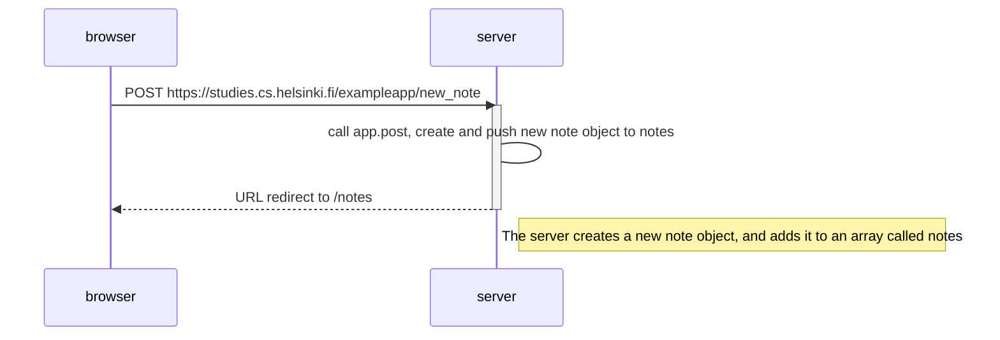

```mermaid
sequenceDiagram
    participant browser
    participant server

    browser->>server: POST https://studies.cs.helsinki.fi/exampleapp/new_note
    activate server
    server->server: call app.post, create and push new note object to notes
    server-->>browser: URL redirect to /notes
    deactivate server

    Note right of server: The server creates a new note object, and adds it to an array called notes
```
