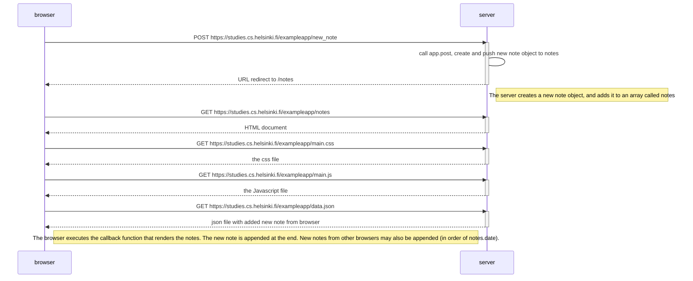

```mermaid
sequenceDiagram
    participant browser
    participant server

    browser->>server: POST https://studies.cs.helsinki.fi/exampleapp/new_note
    activate server
    server->server: call app.post, create and push new note object to notes
    server-->>browser: URL redirect to /notes
    deactivate server

    Note right of server: The server creates a new note object, and adds it to an array called notes
    
    browser->>server: GET https://studies.cs.helsinki.fi/exampleapp/notes
    activate server
    server-->>browser: HTML document
    deactivate server

    browser->>server: GET https://studies.cs.helsinki.fi/exampleapp/main.css
    activate server
    server-->>browser: the css file
    deactivate server

    browser->>server: GET https://studies.cs.helsinki.fi/exampleapp/main.js
    activate server
    server-->>browser: the Javascript file
    deactivate server

    browser->>server: GET https://studies.cs.helsinki.fi/exampleapp/data.json
    activate server
    server-->>browser: json file with added new note from browser
    deactivate server

    Note right of browser: The browser executes the callback function that renders the notes. The new note is appended at the end. New notes from other browsers may also be appended (in order of notes.date).
```
