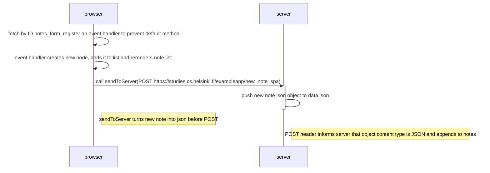

```mermaid
sequenceDiagram
    participant browser
    participant server

    browser->>browser: fetch by ID notes_form, register an event handler to prevent default method
    browser->>browser: event handler creates new node, adds it to list and rerenders note list.
    browser->>server: call sendToServer(POST https://studies.cs.helsinki.fi/exampleapp/new_note_spa)
    activate server
    server->server: push new note json object to data.json
    deactivate server

    Note right of browser: sendToServer turns new note into json before POST
    Note right of server: POST header informs server that object content type is JSON and appends to notes
```
